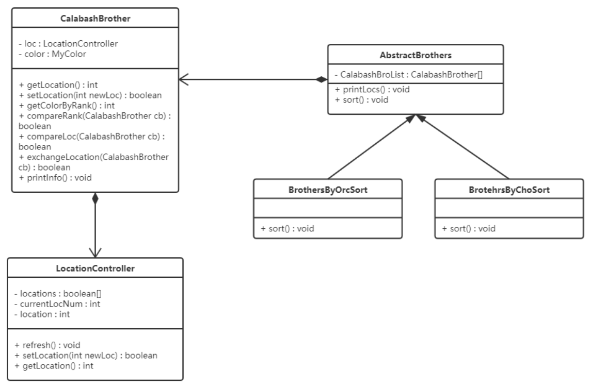

### 类的设计

在本次作业中我设计了6个类，他们的功能如下：

- `LocationController`：只有一个位置属性，可以在初始化的时候随机生成一个合法的位置，在[0,7)之间且无重复，提供获取位置和更改位置的方法，并且一次性最多生成7个位置，通过类的静态方法`refersh()` 可以刷新自身状态，继续生成新位置
- `CalabashBrother`：葫芦娃类，有颜色和位置属性，提供获取自身位置，修改自身位置，获取自身颜色，和其他葫芦娃比较位置，和其他葫芦娃比较颜色，和其他葫芦娃互换位置，输出自身信息的方法
- `AbstractBrothers`：抽象类，只有一个属性`CalabashBroList`，其中存储了7个葫芦娃对象(**葫芦娃在数组中的下标与其位置无关!**)，将七个葫芦娃初始化为不同的颜色，提供了输出所有葫芦娃信息的方法`printLocs`，和抽象方法 `Sort`
- `BrothersByOrcSort` ：继承自`AbstractBrothers`，主要使用 `CalabashBrother`的`getLocation`，`getColorByRank` 和 `setLocation` 方法实现排序
-  `BrotehrsByChoSort`：继承自`AbstractBrothers`，主要使用 `CalabashBrother`的`compareRank`， `compareLoc`和 `exchangeLocation`  方法实现排序
- `OopFoundation`：程序的入口类，提供`main` 方法

类之间的关系如下图所示：

### Orchestration方式：

葫芦娃对象与葫芦娃对象本身并不直接进行消息传递，在函数中通过get和set方法获取和修改每个葫芦娃的位置和颜色并进行比较，控制他们进行位置交换，从而完成排序的过程。

### Choreograph方式：

葫芦娃对象之间进行消息传递(比较位置，比较颜色，互换位置)，来完成排序的过程。

