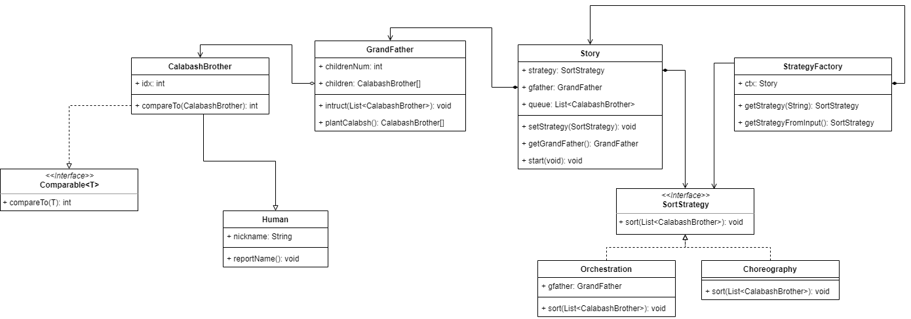

如图：
故事类包含人物“爷爷”，在开始时爷爷会种葫芦，产生一个“葫芦娃”的集合作为孩子集合，爷爷和葫芦娃都继承于人类类，有公用的ncikname和reportName方法。故事产生一个列表类用孩子集合初始化，然后随机排序。

故事类初始化后，决策工厂利用故事上下文初始化，然后从用户输入中得到需用用到的策略实例，最后故事在策略指导下完成列表中葫芦娃的排序，并令其依次报数。

策略类接口需要实现sort方法，分别由两个类实现了这个接口方法，由策略工厂函数实例化并返回给故事实例。