# 面向对象特性使用说明：	

## 封装

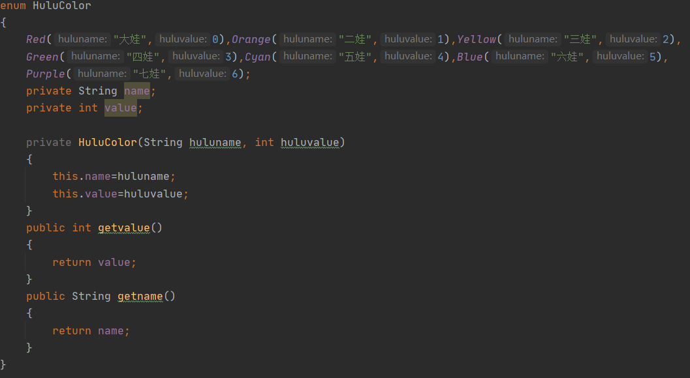

设置枚举类HuluColor 用于维护葫芦娃的颜色，名字，以及对应颜色用来排序的权值。

将权值和名字设置为private，同时设置getvalue以及getname函数作为外部接口实现对葫芦娃名字和权值的封装。

## 继承：

设置一个基础的类hulusort作为父类，内含一个abstract函数sort，以及一个final前缀修饰的函数print

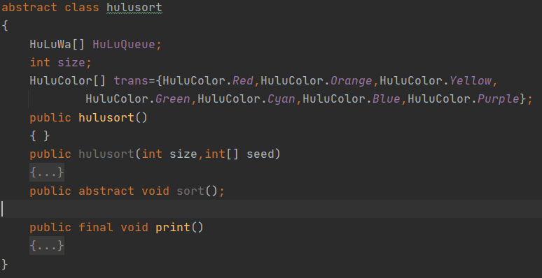

并设置2个子类 orchestration和choreography继承hulusort类，并在2个子类中分别实现不同的sort函数。

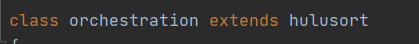

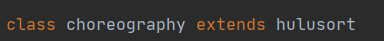

## 多态：

对于hulusort类中的abstract函数sort在orchestration类和choreography类中进行不同的实现。

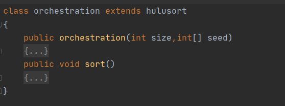

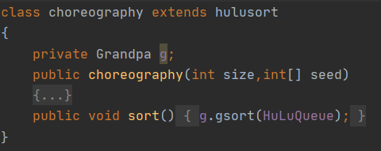

## 合成：

在HuLuWa类中强合成了枚举类HuluColor

# 面向对象语言机制使用说明：	

## 构造器：

HuluColor类 、HuLuWa类 以及hulusort类都含有一个构造器

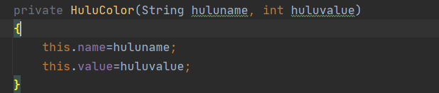

初始化葫芦娃的名称和颜色对应权值

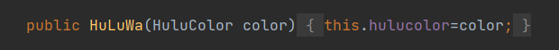

初始化葫芦娃的颜色

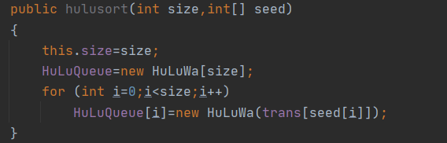

初始化需要排列的葫芦娃队列的具体信息

## 修饰符

abstract:

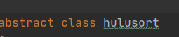

private:

​																							(...)

public:

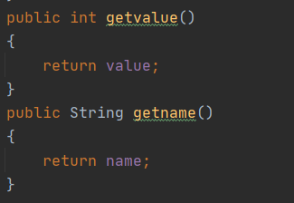

​																						（...）

## 包

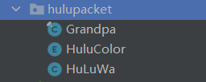

​														将Granpa，HuluColor，HuLuWa类打包

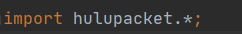

​																			在主程序中引用packet

# 数据结构 类图：

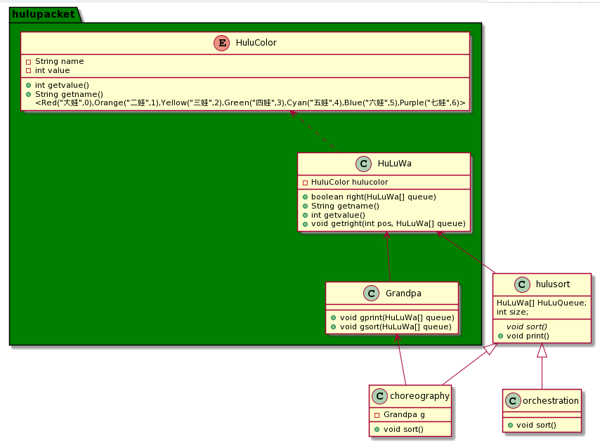

# 输入输出：

## 输入

输入葫芦娃的初始序列

0表示大娃 1表示二娃...（没有设置输入正确性检查，默认输入合法）

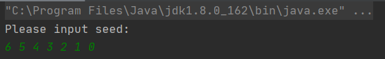

## 输出

输出葫芦娃的初始队列以及2种方式下葫芦娃排序后的结果

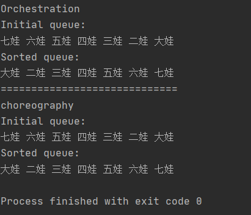